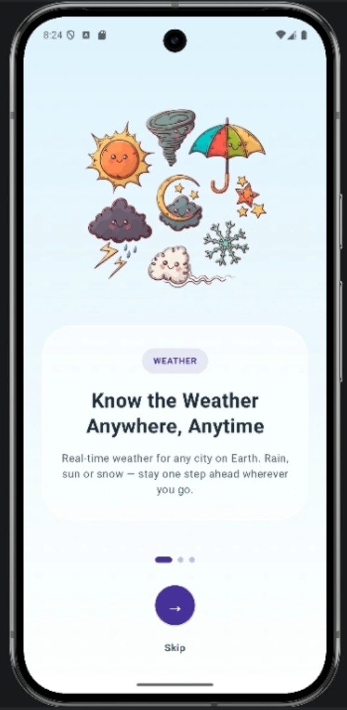
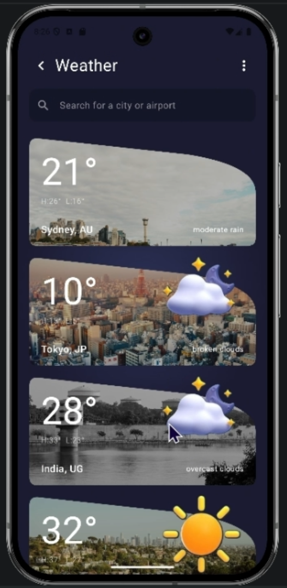

# 🌦️ Weather Forecast App

A premium, modern weather application built with Jetpack Compose, offering real-time weather updates, detailed forecasts, and a seamless user experience.

---

## ✨ Preview

<p align="center">
  
  <br>
</p>

---

## 🚀 Key Features

- **Real-time Weather**: Accurate current weather data based on your location or any city worldwide.
- **Detailed Forecasts**: Hourly and daily forecasts to help you plan your day.
- **Expandable Weather Details**: Get deep insights including Air Quality, UV Index, Sunrise/Sunset times, Wind speed, Humidity, and more.
- **Location Management**: Search and save your favorite cities for quick access.
- **Interactive Map**: Select your location directly from a map for precise weather data.
- **Notifications & Alerts**: Stay informed with morning updates and critical weather alerts.
- **Premium UI/UX**: A beautiful, lighter theme with smooth animations and glassmorphic design elements.
- **Onboarding Experience**: A friendly introduction to the app's features.

---

## 🛠️ Built With

- **Language**: [Kotlin](https://kotlinlang.org/)
- **UI Framework**: [Jetpack Compose](https://developer.android.com/jetpack/compose)
- **Architecture**: MVVM (Model-View-ViewModel)
- **Dependency Injection**: [Hilt](https://developer.android.com/training/dependency-injection/hilt-android)
- **Networking**: [Retrofit](https://square.github.io/retrofit/) & [Gson](https://github.com/google/gson)
- **Image Loading**: [Coil](https://coil-kt.github.io/coil/)
- **Local Database**: [Room](https://developer.android.com/training/data-storage/room)
- **APIs**: OpenWeatherMap API, Unsplash API

---

## 📸 Screenshots

| Splash & Onboarding | Home Screen | Loved cities |
| :---: | :---: | :---: |
|  |  |  |

---

## ⚙️ Getting Started

### Prerequisites

- Android Studio Koala (or later)
- JDK 17
- An API Key from [OpenWeatherMap](https://openweathermap.org/api)

### Installation

1. **Clone the repository**:
   ```bash
   git clone https://github.com/MAD-SAM22/Weather_Forecast_App.git
   ```
2. **Open the project** in Android Studio.
3. **Add your API Key**:
   Create a `local.properties` file in the root directory (if not already present) and add:
   ```properties
   OPEN_WEATHER_API_KEY=your_api_key_here
   ```
4. **Sync Project with Gradle Files**.
5. **Run the app** on an emulator or physical device.

---

## 🤝 Contributing

Contributions are welcome! If you have any ideas, feel free to open an issue or submit a pull request.

---

## 📄 License

This project is licensed under the MIT License - see the [LICENSE](LICENSE) file for details.
